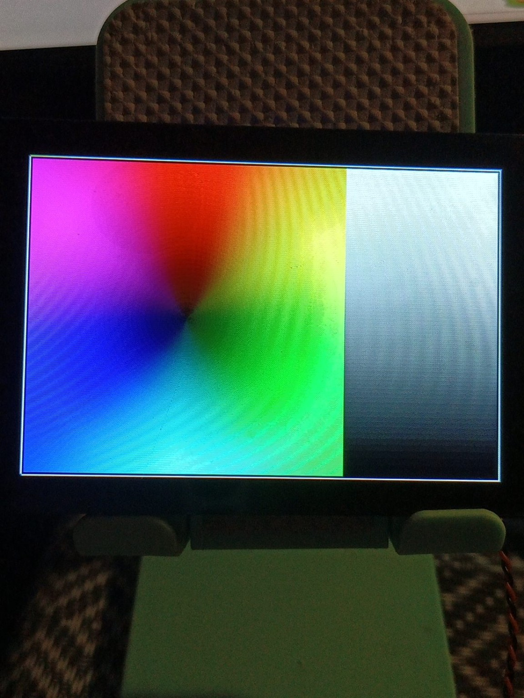

# WT32-SC01-PLUS Lab

Practical hardware/software laboratory for the **WT32-SC01-PLUS** family of ESP32 display modules.

This repository follows the successful organization of [`esp32-2432s028-lab`](https://github.com/AIDevelopersMonster/esp32-2432s028-lab), but adds stricter separation between **claims**, **board variants**, and **measured evidence**.

## Have a WT32-SC01-PLUS? Report your board

We are building a map of real WT32-SC01-PLUS hardware variants rather than assuming that every board sold under the same name is identical.

**No Git knowledge is required.** Windows users can run the supplied passive audit script, photograph their board, and submit the results through a GitHub Issue.

Start here:

- [`docs/VISITOR-HARDWARE-VALIDATION.md`](docs/VISITOR-HARDWARE-VALIDATION.md) — step-by-step visitor guide.
- [`tools/windows/wt32-sc01-plus-audit.ps1`](tools/windows/wt32-sc01-plus-audit.ps1) — read-only Windows host/USB audit with optional chip/flash identification.
- [`docs/software/README.md`](docs/software/README.md) — software tools: what each tool is for and where to download it.
- [`docs/research/wt32-sc01-plus-project-landscape-2026-08-13.md`](docs/research/wt32-sc01-plus-project-landscape-2026-08-13.md) — research snapshot of public WT32-SC01 Plus projects, stacks, complexity and reuse value.
- [`evidence/specimens/panlee-v15-230208-sample-a/hw01-chip/factory-flash-analysis.md`](evidence/specimens/panlee-v15-230208-sample-a/hw01-chip/factory-flash-analysis.md) — verified HW-01 chip/memory/factory-flash analysis for the reference specimen.
- **Issues -> New issue -> “Report your WT32-SC01-PLUS board”** — attach photos and the generated `.txt` report.

The normal reporting workflow does not erase or write flash. Contributors should still review public attachments for MAC addresses or other identifiers before posting.

## Our reference specimen

The first physical specimen in this lab is marked:

- **Panlee**
- **ZX3D50CE08S-V15-USRC**
- **230208**

These markings are treated as specimen evidence, not as proof that every WT32-SC01-PLUS uses the same PCB, display, touch controller, pinout, memory configuration, or peripherals.

### Verified HW-01 memory identity

For this specimen, direct tool measurements currently establish:

- ESP32-S3 QFN56 revision v0.2;
- 40 MHz crystal;
- **16 MiB SPI Flash**;
- Flash ID `0x5E:0x4018`, Quad, 3.3 V;
- **2 MiB embedded PSRAM (`AP_3v3`)**;
- two complete 16 MiB factory-flash reads with identical SHA-256.

Verified factory-image SHA-256:

```text
3772C1BF7D6D2B713973212DDF5C671E3C844A13A8464F675343D9AED4E7F044
```

See the full analysis in [`evidence/specimens/panlee-v15-230208-sample-a/hw01-chip/factory-flash-analysis.md`](evidence/specimens/panlee-v15-230208-sample-a/hw01-chip/factory-flash-analysis.md).

## 2026-08-14 factory-firmware / JTAG milestone

A major reverse-engineering milestone was completed on the **Panlee ZX3D50CE08S-V15-USRC 230208** reference specimen using its verified factory image and the ESP32-S3 built-in USB Serial/JTAG interface.

### Evidence convention used below

- **Level A** — observed directly on the physical reference specimen.
- **Level B** — recovered directly from the verified factory firmware for that specimen.
- **Level C** — external source for the exact or closely related board family.
- **Level D** — inference only; not yet promoted to a verified board fact.

### Built-in USB JTAG confirmed — Level A

The board Type-C connection enumerates the ESP32-S3 built-in USB Serial/JTAG device (`VID 0x303A`, `PID 0x1001`). OpenOCD connected successfully with `board/esp32s3-builtin.cfg`, detected both Xtensa cores, and provided working hardware breakpoints and register/memory access.

No flash programming was performed during this work. The factory flash remained unchanged; only CPU debug state, registers and one RAM byte were temporarily modified through JTAG.

### Hidden factory-test entry confirmed — Level A + B

Static analysis identified a factory-selection routine at:

```text
0x420068B4  factory-mode selection / handshake path
```

A hardware breakpoint on the physical board stopped exactly at `PC = 0x420068B4`, confirming that the recovered function is executed during real factory-firmware startup.

The normal boot path does **not** enter the complete factory test. The recovered code performs a UART-protocol handshake and only enters the hidden test branch when receive succeeds and the received command/value is `0xFF`.

The relevant control-flow region was verified live:

```text
0x4200690B  receive/poll call
0x4200690E  return from receive
0x42006911  reject if receive failed
0x42006914  load received byte
0x42006917  reject unless byte == 0xFF
0x4200691A  accepted "Enter test mode" branch
```

At `0x4200690E`, the physical board showed `a10 = 0`, explaining why an ordinary boot prints `Fine qmsd!` but never enters the hidden production test.

For controlled verification, JTAG was used to change only volatile runtime state:

```text
a10 = 1          # emulate successful receive
[a1] = 0xFF      # emulate accepted factory command
```

Execution then reached `0x4200691A` and subsequently the factory-test runner at `0x42007008`. This demonstrates the hidden branch without altering the factory firmware image.

### Factory UART/RS-485 path recovered from firmware — Level B

The factory protocol implementation is associated with a separate UART/RS-485 path rather than the USB Serial/JTAG console. Current firmware reconstruction gives:

```text
UART1
115200 8N1
TX  = GPIO42
RX  = GPIO1
RTS = GPIO2
RS-485 half-duplex mode
```

This path has not yet been electrically exercised on the reference specimen, so the protocol framing and external fixture behavior remain an active reverse-engineering item.

### Display factory test physically verified — Level A + B

The factory firmware contains an **ST7796** display driver and initializes a 320×480 native panel. Runtime UART output from the physical board reported:

```text
ESP32S3_LCD: lcd init ok
lcd st7796: MADCTL=28
```

`MADCTL = 0x28` is consistent with axis swapping for a 480×320 landscape logical orientation.

After forcing the factory-test branch through JTAG, the physical display visibly produced:

- RGB test patterns;
- a black/white grayscale gradient.



*Factory LCD test on the Panlee ZX3D50CE08S-V15-USRC 230208 reference specimen. The original factory firmware, entered through the recovered hidden test-mode path using JTAG, displays a combined RGB color field and grayscale gradient. This photograph is direct Level A evidence for the working display path.*

This is direct physical confirmation that the factory display path, ST7796 initialization and panel data path are operational on the reference specimen.

### Factory audio path physically verified — Level A + B

The verified factory image contains a valid embedded MP3 asset:

```text
DROM start: 0x3C089988
DROM end:   0x3C0D0EED
size:       0x47565 = 292197 bytes
```

Recovered metadata:

- MP3;
- 44.1 kHz;
- mono;
- 128 kbit/s codec bitrate;
- about 18.23 s duration.

The factory-test runner reaches an audio launcher at:

```text
0x42007140  audio task launcher
0x420070FC  audio task entry
```

Hardware breakpoints on the physical board confirmed both addresses are reached. Immediately after the MP3-bound loads, the live registers contained exactly:

```text
a3 = 0x3C089988   # MP3 start
a2 = 0x3C0D0EED   # MP3 end
a10 = 0x42007078   # callback/function pointer used by the task
```

After removing the breakpoint and resuming execution, the reference specimen **played the embedded audio through its onboard audio path and speaker**. This promotes factory-audio operation from static evidence to direct physical verification.

### Factory test is production/operator oriented — Level A + B

The firmware contains production-test strings including:

```text
Version v2.0
Enter test mode
IO Test
SD Test
USB Con
USB Dis
```

After the audible and visual tests completed, both cores were sampled through JTAG at `PC = 0x42068AD2`, in the system idle/WAITI path. Therefore the final RGB/gradient image is not evidence that the CPU is stuck waiting for a touch action; the active factory-test sequence has returned and the screen is left displaying its final visual inspection pattern while FreeRTOS idles.

The remaining factory-test functions following the audio stage are still to be mapped individually:

```text
0x420069C0
0x42006AAC
0x42006D14
0x42006DF0
0x42006E54
0x42006FC0
```

These are candidates for the remaining LCD/IO/SD/USB production checks and should be identified by further static disassembly plus controlled JTAG breakpoints.

### Current verified conclusions

For the reference specimen, the following are now established without reflashing the device:

- built-in ESP32-S3 USB Serial/JTAG works;
- verified factory code executes at the recovered addresses;
- the normal boot skips a hidden `0xFF`-gated factory-test branch;
- the hidden factory test can be reached by volatile JTAG state manipulation;
- ST7796 factory display initialization is operational;
- RGB and grayscale LCD test patterns are physically visible;
- the factory audio task is created and executed;
- the embedded MP3 bounds recovered from flash are used by the live task;
- onboard audio playback and speaker output work;
- after the production-test sequence, the firmware reaches the normal FreeRTOS idle/WAITI path;
- the 16 MiB factory flash was **not modified** during the experiment.

## Repository philosophy

1. **Identify before assuming.** Every physical board gets a passport.
2. **Separate reported specs from verified facts.** Datasheet/vendor claims go to `docs/`; measurements and dumps go to `evidence/`.
3. **Keep examples incremental.** Start with identity/serial, then display, touch, storage, audio, networking and expansion I/O.
4. **Represent hardware variants explicitly.** OEM/manufacturer/revision differences belong in `config/board_profiles/` and `docs/board-variants/`.
5. **Never convert an untested example into a PASS by documentation alone.** Hardware status must come from a real run.

## Start here

- [`docs/HARDWARE-ACCEPTANCE-START.md`](docs/HARDWARE-ACCEPTANCE-START.md) — acceptance workflow.
- [`docs/VISITOR-HARDWARE-VALIDATION.md`](docs/VISITOR-HARDWARE-VALIDATION.md) — how visitors can report their own board.
- [`docs/board-passports/README.md`](docs/board-passports/README.md) — how to register a specimen.
- [`docs/hardware/01-hardware-overview.md`](docs/hardware/01-hardware-overview.md) — current hardware knowledge and unknowns.
- [`docs/pinout.md`](docs/pinout.md) — pinout working document.
- [`docs/software/README.md`](docs/software/README.md) — software/toolchain index with official download links.
- [`docs/research/wt32-sc01-plus-project-landscape-2026-08-13.md`](docs/research/wt32-sc01-plus-project-landscape-2026-08-13.md) — dated research report on the WT32-SC01 Plus project ecosystem.
- [`evidence/specimens/panlee-v15-230208-sample-a/README.md`](evidence/specimens/panlee-v15-230208-sample-a/README.md) — specimen-specific acceptance evidence.
- [`examples/README.md`](examples/README.md) — planned test sequence.

## Structure

```text
WT32-SC01-PLUS-Lab/
├── .github/
│   ├── ISSUE_TEMPLATE/
│   └── workflows/
├── config/
│   └── board_profiles/       # machine-readable profiles per variant/specimen
├── docs/
│   ├── board-passports/      # specimen identity records
│   ├── board-variants/       # OEM/revision comparison
│   ├── hardware/             # subsystem documentation
│   ├── milestones/           # staged lab progress
│   ├── research/             # dated ecosystem/reference-project research
│   └── software/             # framework/toolchain notes
├── evidence/
│   ├── specimens/            # hashes, measurements and acceptance evidence
│   └── README.md
├── examples/                 # reproducible hardware tests
├── hardware/
│   └── images/               # own board photos / annotated images
├── libraries/                # reusable board support code
├── src/                      # future integrated PlatformIO diagnostic app
├── tools/                    # host-side probes and evidence tooling
├── platformio.ini            # intentionally conservative bootstrap
└── README.md
```

## Planned acceptance sequence

| Stage | Target | Current status |
|---|---|---|
| HW-00 | Photograph and identify the specimen | IN PROGRESS |
| HW-01 | Chip / flash / PSRAM / factory backup | **PASS** |
| HW-02 | Display bus and controller | **PASS — factory-fw/JTAG verified** |
| HW-03 | Touch controller and coordinates | TODO |
| HW-04 | Backlight / buttons / onboard I/O | IN PROGRESS |
| HW-05 | Storage | TODO |
| HW-06 | Audio | **PASS — factory-fw/JTAG verified** |
| HW-07 | Wi-Fi / BLE | TODO |
| HW-08 | Expansion connectors / exposed GPIO | TODO |
| HW-09 | Integrated LVGL/UI stress test | TODO |

## Important

The repository remains conservative about cross-board defaults. Pin assignments, controller identity and peripheral behavior verified on the **Panlee ZX3D50CE08S-V15-USRC 230208** specimen must not be generalized automatically to every WT32-SC01-PLUS/OEM revision.

For the reference specimen, HW-02 is now physically verified through the original factory firmware plus JTAG-controlled execution: the ST7796 path initializes successfully and produces visible RGB and grayscale test patterns. HW-03 remains open: the factory binary and runtime GPIO evidence strongly support an FT5x06-family touch path with interrupt activity on GPIO7, but touch coordinates and behavior have not yet been independently exercised.

HW-06 is also physically verified through the original factory firmware: the recovered audio task consumes the embedded MP3 and produces audible speaker output on the reference specimen.

## License

Code and original text are intended for release under the MIT License. Third-party schematics, photos, firmware and vendor files retain their original licenses and should not be copied into the repository without checking redistribution rights.
