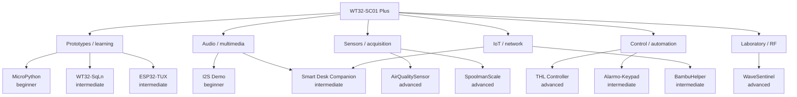

# WT32-SC01 Plus project landscape — research snapshot

**Research date:** 2026-08-13  
**Scope:** public projects, development stacks, hardware variants, complexity and practical reuse for WT32-SC01 Plus / ESP32-S3 boards.

> This document is a dated research snapshot. Repository activity, star/fork counts, software versions and product pages may change after the research date. Hardware claims from third-party projects are not automatically treated as facts about the reference Panlee specimen in this lab.

## Executive summary

The WT32-SC01 Plus ecosystem is relatively small compared with generic ESP32 DevKit/CYD boards, but it is mature enough to support real devices rather than only display demos.

The most useful public projects fall into several groups:

- **learning and reusable HMI foundations:** WT32-SqLn, ESP32-TUX, WT32-SC01-Plus-ESP32 / MicroPython;
- **multimedia:** Smart Desk Companion, WT32-SC01-Plus-I2S-Demo;
- **Home Assistant / automation:** Alarmo-Keypad, THL Controller;
- **sensors and autonomous instruments:** AirQualitySensor-IDF, SpoolmanScale;
- **networked finished products:** BambuHelper;
- **advanced hardware/RF experiments:** WaveSentinel-refactored2.

A central conclusion is that **WT32-SC01 Plus is most valuable as a compact HMI controller**: touchscreen + Wi-Fi/BLE + SD + audio + a limited set of external GPIO/peripheral connections.

For new serious firmware, modern **ESP-IDF + `esp_lcd` + LVGL/`esp_lvgl_port`** is the strongest long-term direction. For maker work, **Arduino + PlatformIO + LovyanGFX/LVGL** remains practical. ESPHome is attractive for Home Assistant terminals, and MicroPython is useful for bring-up and experimentation.

## Important hardware warning: identify the exact board first

The name WT32-SC01 Plus is used for multiple real hardware revisions and market variants. The research found several memory configurations in public sources/projects:

- Wireless-Tag / RIOT documentation commonly describes **WT32-S3-WROVER-N16R2**: 16 MB Flash + 2 MB PSRAM;
- some projects describe 8 MB Flash layouts;
- BambuHelper documents a tested Panlee target with **ESP32-S3-N16R8**: 16 MB Flash + 8 MB PSRAM.

Therefore:

1. do not copy a foreign `partition.csv` blindly;
2. do not assume PSRAM size/mode from the product name;
3. identify the chip/flash/PSRAM on the physical specimen before flashing a full binary;
4. back up the original firmware before erase/write operations.

This is especially relevant to our reference specimen marked:

- **Panlee**
- **ZX3D50CE08S-V15-USRC**
- **230208**

The public projects below often target other PCB/revision labels such as `ZX3D50CE02S` or `ZX3D50CE02S-V13`. Compatibility must be verified experimentally.

## WT32-SC01 is not WT32-SC01 Plus

The original **WT32-SC01** and **WT32-SC01 Plus** are different hardware platforms.

The older SC01 uses an older ESP32-WROVER platform and a different display connection strategy. The Plus uses ESP32-S3 and an 8-bit 8080-style parallel display interface in the commonly documented configuration.

GPIO maps, display drivers, build flags and binary images for the old SC01 must not be assumed compatible with Plus.

## Commonly documented Plus hardware

Public Wireless-Tag/RIOT/project documentation commonly describes the Plus platform as:

- ESP32-S3;
- 3.5-inch IPS LCD, 480×320;
- ST7796UI display controller;
- 8-bit MCU8080 / parallel interface;
- FT6336U/FT63xx-family capacitive touch;
- microSD;
- I2S audio output;
- RS-485 on common board variants;
- several exposed GPIOs.

Frequently cited signal assignments include:

| Function | GPIO commonly documented |
|---|---:|
| Touch SDA | GPIO6 |
| Touch SCL | GPIO5 |
| Touch INT | GPIO7 |
| LCD/touch reset | GPIO4 |
| Backlight | GPIO45 |
| microSD CS | GPIO41 |
| microSD CMD | GPIO40 |
| microSD CLK | GPIO39 |
| microSD D0 | GPIO38 |
| I2S LRCK | GPIO35 |
| I2S BCLK | GPIO36 |
| I2S DOUT | GPIO37 |
| Expansion | GPIO10, 11, 12, 13, 14, 21 |

These values are **research inputs**, not yet promoted to verified facts for every specimen in this repository.

## Complexity model used in this research

### Beginner

Typical characteristics:

- one sketch/script/YAML configuration;
- little custom application code;
- primarily built-in display/touch/Wi-Fi;
- little or no soldering;
- suitable for first bring-up.

### Intermediate

Typical characteristics:

- multiple software modules;
- LVGL plus Wi-Fi/OTA/filesystem;
- PlatformIO or ESP-IDF toolchain;
- one or two external peripherals;
- some knowledge of boot mode, wiring and debugging required.

### Advanced

Typical characteristics:

- multi-module firmware;
- multiple subsystems/tasks;
- web UI, SD/NVS/OTA, sensors, relays, RF or mechanical integration;
- calibration and/or real hardware assembly;
- lab tools and systematic debugging usually required.

## Project map

Activity values below are snapshots from the 2026-08-13 research and will become stale.

| Project | Repository | Category | Complexity | Main stack | Activity snapshot | License status noted in research |
|---|---|---|---|---|---|---|
| **Smart Desk Companion** | https://github.com/SubCoderHUN/WT32-SC01-PLUS | Audio / IoT | Intermediate | Arduino, PlatformIO, LVGL, LovyanGFX | pushed 2025-10-26; 37 stars / 5 forks | Apache-2.0 |
| **WT32-SqLn** | https://github.com/janick/WT32-SqLn | Learning / prototypes | Intermediate | ESP-IDF 5.0.2, LVGL 8, SquareLine | pushed 2023-09-30; 95 / 10 | MIT |
| **ESP32-TUX** | https://github.com/sukesh-ak/ESP32-TUX | Reusable HMI | Intermediate | ESP-IDF, LVGL 8, LovyanGFX | pushed 2024-02-27; 276 / 63 | MIT |
| **AirQualitySensor-IDF** | https://github.com/dk307/AirQualitySensor-IDF | Sensors / data acquisition | Advanced | ESP-IDF, LVGL, web/HomeKit | pushed 2025-08-01; 7 / 0 | no clear license found in research |
| **THL Controller** | https://github.com/MattDoran109/thl-controller | Automation / control | Advanced | ESP-IDF 5.5.x, LVGL 9 | pushed 2026-05-01; 2 / 0 | MIT |
| **Alarmo-Keypad** | https://github.com/iroger/Alarmo-Keypad | Home Assistant | Intermediate | ESPHome | pushed 2026-07-01; 5 / 1 | MIT |
| **WT32-SC01-Plus-ESP32** | https://github.com/Cesarbautista10/WT32-SC01-Plus-ESP32 | Learning / prototypes | Beginner | MicroPython | pushed 2025-03-26; 8 / 1 | MIT |
| **WT32-SC01-Plus-I2S-Demo** | https://github.com/thisoldcpu/WT32-SC01-Plus-I2S-Demo | Audio | Beginner | Arduino, AudioI2S, LVGL, LovyanGFX | pushed 2023-01-03; 2 / 2 | MIT |
| **SpoolmanScale** | https://github.com/Niko11111/SpoolmanScale | Sensors / IoT / 3D printing | Advanced | Arduino/PlatformIO, LVGL, NFC, load cell | pushed 2026-08-10; 52 / 11 | no clear LICENSE found in research |
| **BambuHelper** | https://github.com/Keralots/BambuHelper | IoT / 3D printing | Intermediate overall | Arduino/PlatformIO, MQTT | pushed 2026-08-09; 423 / 57 | README states MIT; verify current repo license |
| **WaveSentinel-refactored2** | https://github.com/OzInFl/WaveSentinel-refactored2 | RF / network laboratory | Advanced | PlatformIO, Arduino + ESP-IDF APIs, LVGL | pushed 2026-07-27; 2 / 2 | no standard SPDX license noted |

## Classification by application

## Project notes

### Smart Desk Companion

Repository: https://github.com/SubCoderHUN/WT32-SC01-PLUS

A finished desk information/multimedia terminal with:

- clock;
- OpenWeatherMap weather information;
- Wi-Fi/city/brightness settings;
- internet radio;
- persistent settings;
- optional SD logging;
- LVGL UI with SquareLine project sources.

Why it is useful to this lab: it demonstrates a realistic **LVGL + Wi-Fi + audio + SD** application without immediately requiring a full custom ESP-IDF architecture.

Research complexity: **intermediate**.

### WT32-SqLn

Repository: https://github.com/janick/WT32-SqLn

One of the strongest board-specific engineering references. It documents not only UI development but also practical programming details:

- ESP-IDF 5.0.2;
- LVGL 8 / SquareLine;
- bootloader entry;
- BOOT=GPIO0 / EN / UART details;
- Wireless-Tag programmer and alternative programming methods;
- OTA workflow;
- GPIO/header information.

Why it is useful: **board bring-up, boot/programming knowledge and ESP-IDF/SquareLine integration**.

Research complexity: **intermediate**.

### ESP32-TUX

Repository: https://github.com/sukesh-ak/ESP32-TUX  
Web installer: https://tux.sukesh.me

A reusable HMI template rather than a single-purpose device. It includes concepts such as:

- Home / Remote / Settings / OTA screens;
- Wi-Fi provisioning;
- brightness, themes and orientation;
- filesystem/SD integration;
- OTA;
- LVGL task-safe UI access patterns.

Why it is useful: probably the best researched **reusable HMI foundation** among the Plus-specific public projects.

Research complexity: **intermediate for development; beginner for trying the prebuilt web installer**.

### AirQualitySensor-IDF

Repository: https://github.com/dk307/AirQualitySensor-IDF

A complete air-quality instrument using sensors such as SHT31, BH1750, SPS30 and Sensirion CO2 devices. Reported features include:

- LVGL dashboard and graphs;
- automatic brightness;
- Wi-Fi provisioning;
- embedded responsive web server;
- firmware upgrade;
- SD file management;
- remote debug;
- HomeKit integration.

Why it is useful: reference architecture for a **multi-sensor networked instrument**.

Research complexity: **advanced**.

### THL Controller

Repository: https://github.com/MattDoran109/thl-controller

A modern environmental controller originally aimed at mushroom cultivation, but architecturally applicable to greenhouses, incubators and climate chambers.

Reported subsystems include:

- touchscreen dashboard;
- SHT31 / SCD41 / DS18B20 and water-level sensing;
- five relay channels;
- hysteresis control;
- schedules;
- SD logging;
- responsive web UI;
- NTP/mDNS;
- SoftAP fallback;
- ntfy notifications;
- LVGL 9 and ESP-IDF 5.5.x-era components.

Why it is useful: one of the strongest references for a **modern ESP-IDF + LVGL 9 control-system architecture**.

Research complexity: **advanced**.

### Alarmo-Keypad

Repository: https://github.com/iroger/Alarmo-Keypad

Turns the board into a Home Assistant/Alarmo wall keypad using ESPHome. Includes alarm modes, touchscreen keypad behaviour, audio assets and enclosure resources.

Why it is useful: shows that a useful Plus device can be built mostly through **ESPHome configuration instead of a custom C/C++ firmware stack**.

Research complexity: **intermediate system integration, low programming complexity**.

### WT32-SC01-Plus-ESP32 / MicroPython

Repository: https://github.com/Cesarbautista10/WT32-SC01-Plus-ESP32

A compact MicroPython reference collection for display/touch experiments.

Why it is useful:

- rapid board bring-up;
- basic display/touch validation;
- experimentation without first configuring a large ESP-IDF project.

Research complexity: **beginner**.

### WT32-SC01-Plus-I2S-Demo

Repository: https://github.com/thisoldcpu/WT32-SC01-Plus-I2S-Demo

A minimal audio demonstration using Arduino/LVGL/LovyanGFX and I2S. The project reports testing on **Panlee ZX3D50CE02S-V13**.

Why it is useful: a small, focused **audio smoke test** before integrating audio into a larger application.

Research complexity: **beginner**.

### SpoolmanScale

Repository: https://github.com/Niko11111/SpoolmanScale  
Documentation: https://niko11111.github.io/SpoolmanScale-Docs/

A complete filament spool scale integrated with Spoolman. It combines:

- WT32-SC01 Plus touchscreen UI;
- load cell / NAU7802;
- PN532 NFC;
- Wi-Fi/network integration;
- LVGL;
- mechanical assembly and calibration;
- Web Flasher/release tooling.

Why it is useful: a strong example of **end-to-end hardware + firmware + mechanical product integration**.

Research complexity: **advanced**.

### BambuHelper

Repository: https://github.com/Keralots/BambuHelper  
Web flasher: https://keralots.github.io/BambuHelper/

A touchscreen network dashboard for Bambu Lab printers with MQTT, web configuration, OTA and support for multiple ESP32 display boards.

The research identified a dedicated WT32-SC01 Plus target and a tested Panlee configuration reported as **ESP32-S3-N16R8 / 16 MB Flash / 8 MB PSRAM**.

Why it is useful:

- a ready-to-use useful device with browser flashing;
- a modern example of maintaining many display-board targets in one codebase;
- a reminder that real Panlee variants can differ in PSRAM from official N16R2 documentation.

Research complexity: **beginner to install; advanced to modify; intermediate overall**.

### WaveSentinel-refactored2

Repository: https://github.com/OzInFl/WaveSentinel-refactored2

An advanced laboratory project combining the touchscreen platform with additional RF/IR/network peripherals such as CC1101, SD, I2S, Wi-Fi/BLE and LVGL.

Why it is useful: a reference for **complex multi-peripheral integration**, not a first bring-up project.

Research complexity: **advanced**.

Use RF/network test functionality only on owned systems or where explicit authorization exists.

## Recommended learning path

### For first board bring-up

1. identify the exact ESP32-S3 / Flash / PSRAM configuration;
2. back up factory flash;
3. test display and touch with a small known-good example;
4. use the MicroPython project or a minimal LovyanGFX/ESP-IDF example;
5. test audio separately with the I2S demo if required.

### For a custom HMI

Best references from this research:

1. **ESP32-TUX** — reusable UI/HMI architecture;
2. **WT32-SqLn** — board programming/boot/OTA/SquareLine details;
3. **THL Controller** — newer ESP-IDF/LVGL 9 architecture.

### For Home Assistant

Start with **Alarmo-Keypad / ESPHome** rather than writing a full custom firmware stack.

### For sensor/control products

- instrument/data acquisition: **AirQualitySensor-IDF**;
- automation/relays: **THL Controller**;
- hardware + calibration + mechanics: **SpoolmanScale**.

### For a ready-made useful application

**BambuHelper** is the strongest example in the researched set because it provides a browser flashing path and a maintained multi-board codebase.

## SDK / framework comparison

### ESP-IDF + native display components

Best fit for:

- long-lived firmware;
- complex products;
- low-level control;
- modern LVGL integration;
- systematic component architecture.

The THL Controller is the most relevant modern example in the researched set.

### Arduino + PlatformIO + LovyanGFX

Best fit for:

- maker devices;
- rapid integration;
- large Arduino library ecosystem;
- audio/NFC/sensor projects.

Smart Desk Companion and SpoolmanScale are useful references.

### ESPHome

Best fit when the board is primarily a **Home Assistant terminal/controller**. It minimizes custom firmware code and exposes a higher-level configuration model.

### MicroPython

Best fit for:

- first experiments;
- hardware probing;
- educational work;
- quick UI/peripheral prototypes.

It is less attractive than C/C++ stacks for heavy combined GUI/network/audio workloads.

## SquareLine Studio note

SquareLine Studio is useful for designing LVGL screens, but it should not be treated as the board support package.

The safe workflow is:

1. first make a known LVGL/display/touch demo work on the exact board;
2. establish the hardware layer independently;
3. export SquareLine UI;
4. integrate the exported UI into the verified runtime.

WT32-SqLn and Smart Desk Companion are useful examples of this separation.

## Library note: TFT_eSPI versus Plus parallel bus

Older WT32-SC01 guidance often points to TFT_eSPI. The Plus platform has an ESP32-S3 parallel display wiring pattern that has historically been problematic for older TFT_eSPI parallel paths, especially where GPIO numbers above 31 are involved.

The researched Plus projects more commonly use:

- **LovyanGFX**;
- ESP-IDF `esp_lcd_*` components;
- modern ESPHome display components.

For new work, do not select a display library only because it was successful on the original WT32-SC01.

## Licensing caution

A public GitHub repository is not automatically reusable code.

The research found projects where a standard license was not clearly detected. Before copying code into this lab or a commercial derivative:

1. inspect the current repository `LICENSE` file;
2. verify SPDX/license terms at the exact revision being reused;
3. preserve required notices;
4. avoid importing code when reuse rights are unclear.

Reading a project for architecture/hardware research is different from redistributing its source.

## Useful reference links

| Resource | URL | Use |
|---|---|---|
| Wireless-Tag catalog | https://shop.wireless-tag.com/ | Official vendor information |
| WT32-SC01 Plus product page | https://shop.wireless-tag.com/products/wt32-sc01-plus-16mb-flash-3-5-inch-multi-touch-lcd-screen-with-gui-firmware-esp32-s3-development-board-wifi-ble-mcu-compatible-with-arduino | Product/specification reference |
| RIOT OS board support | https://api.riot-os.org/group__boards__esp32s3__wt32__sc01__plus.html | Independent board/BSP reference |
| Habr SC01/Plus discussion | https://habr.com/ru/articles/748818/ | Russian-language platform context |
| Home Assistant / ESPHome discussion | https://community.home-assistant.io/t/wt32-sc01-plus-esp32-s3-esp-home/659661/55 | Community display/touch/PSRAM configurations |
| SquareLine forum | https://forum.squareline.io/t/wt32-sc01-support/5989 | SquareLine + WT32 discussion |
| MicroPython reference | https://github.com/Cesarbautista10/WT32-SC01-Plus-ESP32 | Quick bring-up |
| WT32-SqLn | https://github.com/janick/WT32-SqLn | ESP-IDF / boot / SquareLine / OTA |
| ESP32-TUX | https://github.com/sukesh-ak/ESP32-TUX | Reusable HMI |
| SpoolmanScale docs | https://niko11111.github.io/SpoolmanScale-Docs/ | Wiring and assembly reference |
| TFT_eSPI discussion | https://github.com/Bodmer/TFT_eSPI/issues/2078 | Historical parallel-bus compatibility context |
| Arduino_GFX device declarations | https://github.com/moononournation/Arduino_GFX/wiki/Dev-Device-Declaration | ZX3D50CE02S / Plus display configuration reference |

## Research conclusion

WT32-SC01 Plus is most justified when the project needs a **compact integrated touchscreen HMI** rather than merely an ESP32 MCU.

Strong use cases include:

- wall panels;
- environmental controllers;
- information dashboards;
- measurement instruments;
- 3D-printer accessories;
- control terminals;
- compact networked appliances.

For this laboratory, the best next step is not to copy one public project wholesale. Instead, use these projects as reference implementations while keeping our hardware acceptance process specimen-specific:

**identify → back up → verify display/touch/memory → reproduce minimal tests → select framework → integrate application features.**
