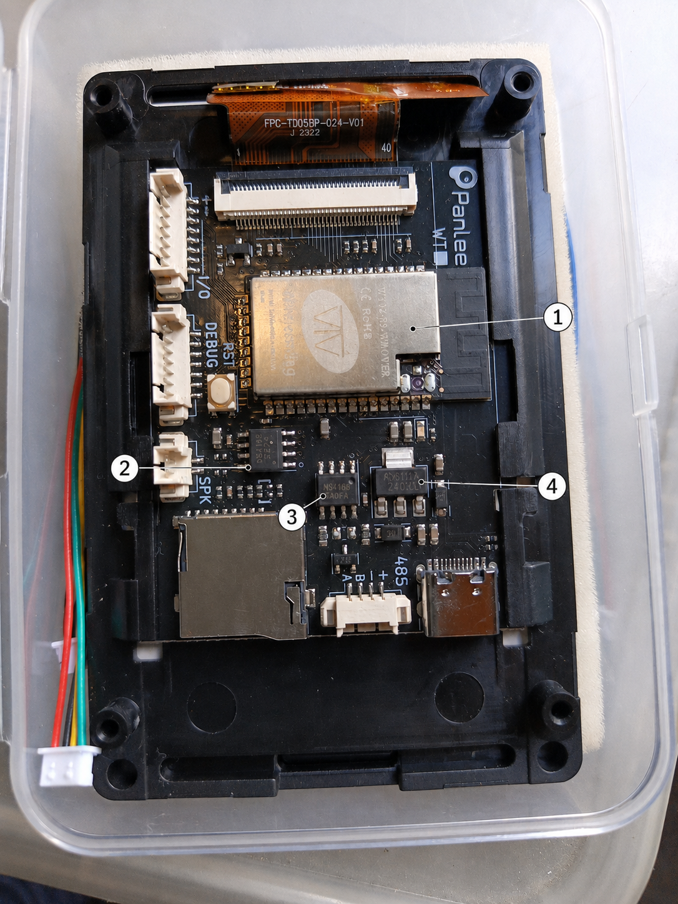

# Major ICs — Panlee `ZX3D50CE08S-V15-USRC 230208` sample A

This note documents the major ICs visible on the physical specimen and the numbered presentation overlay.

> Evidence rule: the numbered overlay is used only to show **location**. Component identity is based on the original photographs and readable package markings, not on text regenerated by the image model.

## Annotated overview

## Numbered components

| No. | Visible marking / identification | Component | Function on this board | Confidence | Manufacturer / datasheet |
|---:|---|---|---|---|---|
| **1** | `WT32-S3-WROVER`, Wireless-Tag | WT32-S3-WROVER module family | Main MCU/radio module based on ESP32-S3; Wi-Fi + Bluetooth/BLE. The exact flash/PSRAM suffix is not claimed from this overlay alone. | **VERIFIED — family** | [Wireless-Tag product page](https://shop.wireless-tag.com/products/wt32-s3-wrover-10pcs-wireless-tag-original-esp32s3-wifi-module-wt32-s3-wrover-ble-module-based-on-esp32-s3-chips-for-aiot-smart-home) · [Espressif ESP32-S3 technical documents](https://www.espressif.com/en/support/download/documents/chips) |
| **2** | `NS4168` | Nsiway NS4168 | 2.5 W class-D mono audio power amplifier with I2S digital input; drives the onboard `SPK` output path. | **VERIFIED** | [Nsiway NS4168 manufacturer page](https://nsiway.com.cn/list_40/138.html) |
| **3** | `SP3485E` visible on package | MaxLinear/Sipex SP3485 family | 3.3 V half-duplex RS-485/RS-422 transceiver between ESP32 UART/control signals and the external `485` A/B connector. | **HIGH / PROBABLE exact suffix** | [MaxLinear SP3485 product + datasheet page](https://www.maxlinear.com/product/interface/serial-transceivers/rs-485-rs-422/sp3485) |
| **4** | `AMS1117` and `33`/3.3-style suffix visible | AMS1117-family LDO, probably fixed 3.3 V version | Linear regulator in the board power section. Exact manufacturer lot/version is not proven by the top marking alone. | **HIGH / PROBABLE 3.3 V** | Legacy manufacturer: Advanced Monolithic Systems; [AMS1117 datasheet mirror](https://www.alldatasheet.com/datasheet-pdf/pdf/49118/ADMOS/AMS1117.html) |

## Additional discrete device above the I/O connector

A small **SOT-23 BJT ("triode")** is visible above the `I/O` connector. Its package top-mark appears to be **`Y1`**.

Working identification:

- probable part: **SS8050**
- type: **NPN bipolar junction transistor (BJT)**
- package: **SOT-23**
- marking: **`Y1`** is used for SS8050 by some manufacturers
- board-specific function: **not claimed yet**; it should be determined from trace/schematic analysis
- status: **PROBABLE**, because SMD top-marks are not globally unique across manufacturers

Reference manufacturer/datasheet:

- [UMW product catalogue — SS8050, SOT-23](https://www.umw-ic.com/en/product?category_key=&page=84&search_key=)
- [SS8050 `Y1` marking datasheet reference](https://www.alldatasheet.com/datasheet-pdf/marking/1790575/UMW/SS8050.html)

The SS8050 reference above demonstrates a documented `Y1` top-mark implementation; it does **not** by itself prove that the transistor fitted to this sample was manufactured by UMW.

## Related original evidence

Raw images remain the evidence source and must not be replaced by the annotated derivative:

- `image-1786523855319.jpg` — complete rear overview
- `image-1786523897406.jpg` — WT32-S3-WROVER module close-up
- `image-1786523914044.jpg` — board ID, power/RS485/audio area
- `image-1786523930462.jpg` — I/O, DEBUG and SPK connectors
- `image-1786523948067.jpg` — IC close-up
- `image-1786523959164.jpg` — RS485 connector orientation

## Identification status legend

- **VERIFIED** — readable marking plus matching manufacturer/board documentation.
- **HIGH / PROBABLE** — marking and circuit context strongly match, but exact suffix/vendor variant is not fully established.
- **PROBABLE** — plausible identification from package/top-mark/context; requires electrical tracing, schematic or additional evidence before promotion to VERIFIED.
